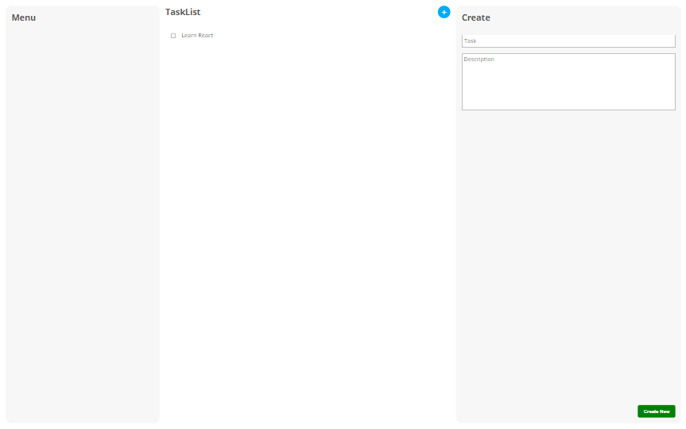

# React Task Manager App



The React Task Manager App is a simple yet powerful application that allows users to manage their tasks effectively. Whether you need to create new tasks, edit existing ones, or mark them as completed, this app provides a seamless and intuitive interface to help you stay organized.

## Features

- **Create Tasks:** Add new tasks to your list by simply entering a task name and description.
- **Edit Tasks:** Update task descriptions or modify task details as needed.
- **Delete Tasks:** Easily remove tasks from the list when they are no longer needed.
- **Mark as Completed:** Mark tasks as completed to keep track of your progress.

## Getting Started

Follow these instructions to get the app up and running on your local machine:

1. **Clone the Repository:** Start by cloning this repository to your local machine using the following command:

   ```bash
   git clone https://github.com/greatochuko/task-manager.git
   ```

2. **Navigate to the Directory:** Move into the project directory:

   ```bash
   cd task-manager
   ```

3. **Install Dependencies:** Install the necessary dependencies using npm or yarn:

   ```bash
   npm install
   # or
   yarn install
   ```

4. **Run the App:** Start the development server to run the app locally:

   ```bash
   npm start
   # or
   yarn start
   ```

5. **Open in Browser:** Once the development server is running, open your browser and navigate to `http://localhost:3000` to see the app in action.

## Contributing

Contributions are welcome! If you find any issues or have suggestions for improvements, feel free to open an issue or create a pull request. Be sure to follow the project's code of conduct.

## Acknowledgments

- This app was built using [React](https://reactjs.org/), a JavaScript library for building user interfaces.
- The project structure and design inspiration were influenced by various online tutorials and resources.

---

Feel free to customize this README to include any additional information specific to your app. Good luck and happy coding! If you have any further questions, feel free to reach out.
